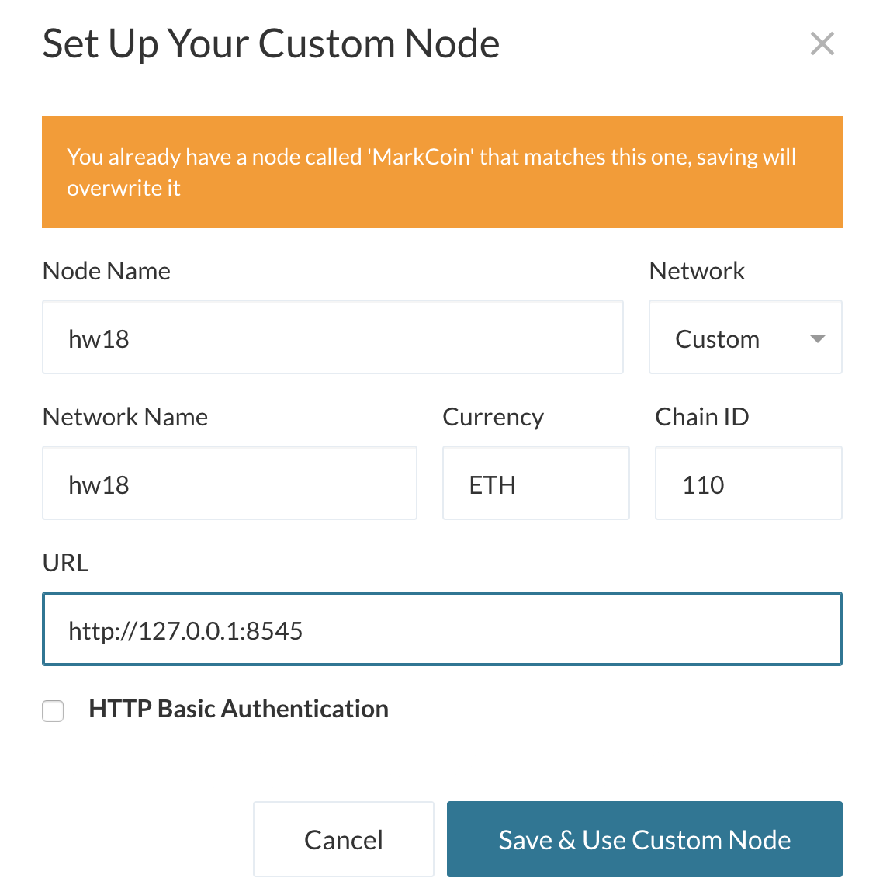
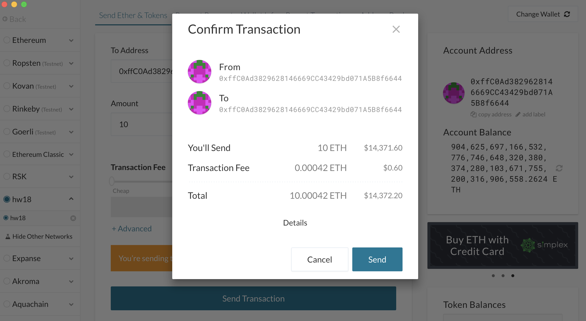

# hw18-blockchain - Proof of Authority Development Chain

## 1/ Create accounts for two nodes for the network —> node1 + node2

### 1.1/ node1
* Public address:   0xffC0Ad3829628146669CC43429bd071A5B8f6644

### 1.2/ node2
* Public address:   0xA511dc7ece42633e5B97C7d16c05629191F20ea7

## 2/ Generate genesis block.

### 2.1/  Genesis block
* `puppeth`, to configure a new genesis block.
* `Proof of Authority` as consensus algorithm.
* Accounts to seal
    * Public address:   0xffC0Ad3829628146669CC43429bd071A5B8f6644
    * Public address:   0xA511dc7ece42633e5B97C7d16c05629191F20ea7
* Accounts to pre-fund.
    * Public address:   0xffC0Ad3829628146669CC43429bd071A5B8f6644
    * Public address:   0xA511dc7ece42633e5B97C7d16c05629191F20ea7
    
    

### 2.2/  Export genesis configurations
* Export Json

## 3/  Initialize nodes with the genesis' json file.

## 4/ Run nodes to begin mining blocks.
    
### 4.1 Terminal 1 —> Node 1

### 4.2 Terminal 2 —> Node 2

### 4.3 Nodes 1 & 2 - mining

## 5. Integrate the block chain into MyCryto

### 5.1 MyCrypto Custome Node 

### 5.2 Send ETH 

### 5.3 Confirm transaction 

### 5.4 Broadcast transaction

### 5.5 Transaction Status

